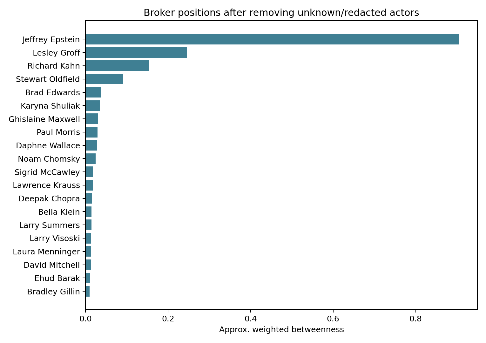
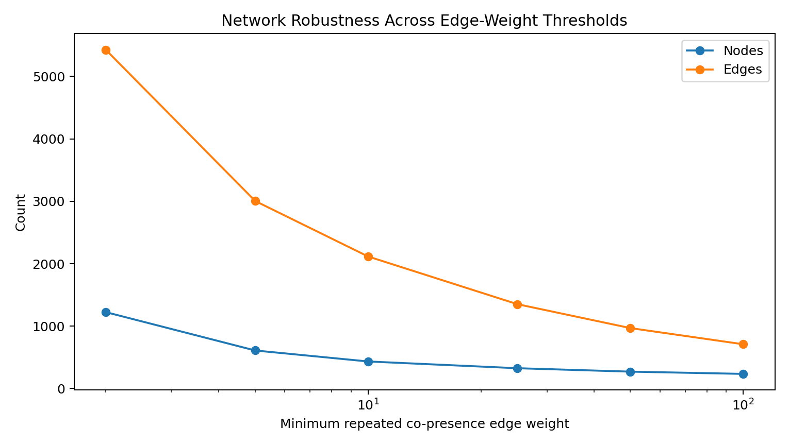
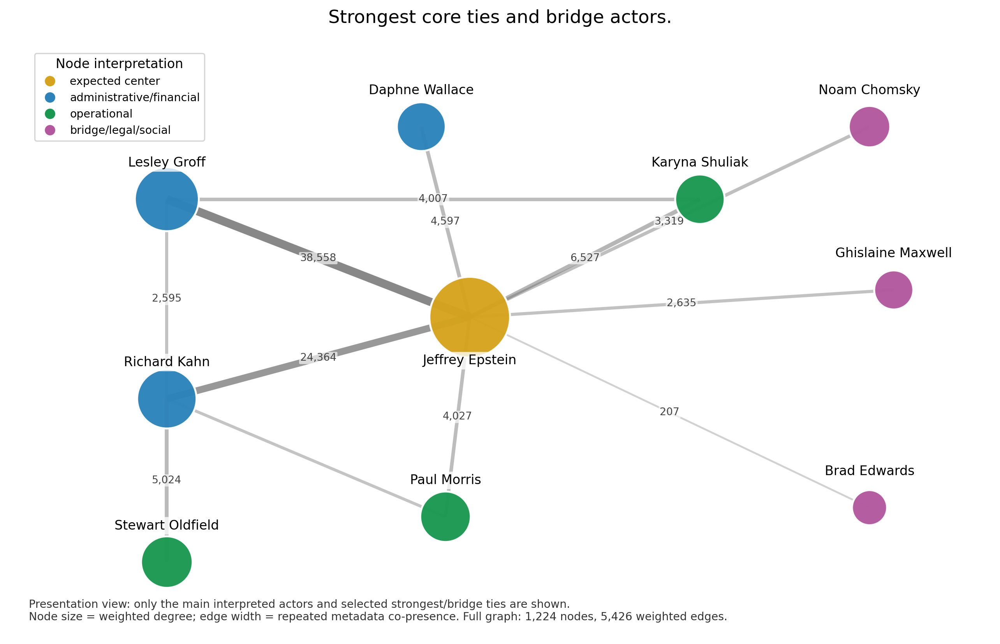

\newpage

# Email Co-presence Network Centrality in the Epstein Email Archive

**Course:** BUSS425  
**Assignment:** 2nd Assignment: Analysis of an Informal Network  
**Group:** Gépállatok  
**Team members:** Bernáth Máté, Kossuth Hugó, Medvegy Gábor, Salomon Brúnó  
**Date:** June 2026  
**External research artifact:** 3D network graph  

\newpage

# Table of Contents

Abstract  
1. Introduction  
2. Data and Network Construction  
3. Methods  
3.1 Network Definition and Adjacency Matrix  
3.2 Centrality Measures  
3.3 Visualization and Robustness Checks  
4. Results  
4.1 Descriptive Network Structure  
4.2 Centrality Rankings  
4.3 Intermediaries Beyond the Expected Center  
4.4 Network Visualization  
4.5 Robustness Checks  
4.6 Simplified Broker Map and Additional Result  
5. Discussion  
6. Error Analysis and Threats to Validity  
7. Conclusion and Next Steps  
Appendix  
References  

# Abstract

This report examines the released Epstein email archive as an informal co-presence network. It asks: **which actors occupy central positions in the email metadata, and what can be learned once Jeffrey Epstein's expected dominance is set aside?** After unknown and redacted labels are removed, the network contains 1,224 visible actors and 5,426 weighted edges. Two actors are linked when they appear in the same retained email metadata record, whether as sender, recipient, cc, or bcc. The weight of an edge is the number of retained records in which the pair appears together.

Three measures are used: degree, weighted degree, and betweenness centrality. Epstein ranks first on all three, with degree 730, weighted degree 343,926, and betweenness 0.904. Because the archive is centered on his correspondence, this is a useful baseline rather than an unexpected result. The more informative part of the analysis is the group immediately below him. Lesley Groff and Richard Kahn stand out through both reach and repeated co-presence. Stewart Oldfield, Brad Edwards, Karyna Shuliak, Ghislaine Maxwell, Paul Morris, Daphne Wallace, and Noam Chomsky appear through different combinations of volume and brokerage.

These findings need to be read narrowly. A co-presence edge is not proof that two people communicated directly, had a close relationship, collaborated, shared intent, or committed wrongdoing. It records an association inside the released email metadata. The network is useful for studying the structure of that archive, not for reconstructing the full real-world network around Epstein.

# 1. Introduction

The released Epstein email archive contains more than message text. Its metadata records who appeared as sender, recipient, cc, or bcc across a large set of emails. Once those appearances are linked at the actor level, the archive can be studied as a network. This makes it possible to ask which names are broadly connected, which pairs recur most often, and which actors sit between otherwise less connected areas of the graph.

The research question is:

> **Which actors are structurally central in the Epstein email co-presence network, and what does centrality reveal beyond the expected dominance of Jeffrey Epstein?**

The second part matters. Epstein is the focal actor of the archive, so a ranking that simply places him first would not tell us much. The useful question is what happens below that obvious center. Some actors may appear with many different people. Others may recur frequently with a smaller set of names. A third group may be visible because their positions connect sections of the network that would otherwise be more distant from one another.

Email archives are a practical source for this type of analysis because they preserve routine traces of coordination: scheduling, travel, payments, introductions, reminders, documents, legal correspondence, and social arrangements. Studies of the Enron corpus have shown that email records can be used as relational data as well as text (Klimt & Yang, 2004; Diesner et al., 2005). The same general approach is useful here, although this archive raises a particularly important interpretive issue.

The graph in this report is a **co-presence network**. An edge means that two actors appeared in the same email metadata record. It does not automatically mean that one person sent a message to the other. It also does not establish friendship, collaboration, responsibility, shared intent, or wrongdoing. Distribution lists, copied recipients, administrative threads, and forwarded messages can all place names together in metadata. This limitation is repeated throughout the report because network diagrams can make a weak association look more definite than it is.

The analysis has three main parts. First, it constructs an undirected weighted network from the retained metadata. Second, it compares degree, weighted degree, and betweenness centrality. Third, it checks whether the main pattern remains visible under stricter edge thresholds and in a directed sender-recipient version of the graph.

# 2. Data and Network Construction

The boundary of the network is the released Epstein email archive used in the project. It is not a list of every person associated with Epstein in any setting. It includes only actors who appear in the available metadata after filtering. Centrality is therefore relative to this archive. A person who is prominent in these records may not have the same position in a network built from a different source.

The local pipeline uses three linked tables. `fact_emails.parquet` contains email-level fields, including cleaned text and metadata. `bridge_email_people.parquet` links each email to the people appearing in sender, recipient, cc, or bcc fields. `dim_people.parquet` stores canonical identifiers and display names. The network is built from the person-email participation links.

The raw email table contains 1,758,382 rows. The broader project applies text-oriented cleaning rules, including filters for very short rows, visibly redacted senders, and likely non-English content. The network stage has an additional actor-level filter: unknown and redacted labels are removed so that placeholders do not dominate the rankings. This produces a more readable graph, but it also means that the results describe visible identities in the released metadata rather than the full underlying communication environment.

The final filtered network has the following structure:

| Network property | Value |
|---|---:|
| Nodes | 1,224 |
| Weighted edges | 5,426 |
| Edge rule | Two actors appeared in the same email metadata record |
| Edge weight | Number of retained repeated co-presences |
| Actor filter | Unknown and redacted actors removed |
| Crowded-email cutoff | Emails with more than 25 actors skipped |
| Minimum edge threshold | At least 2 repeated co-presences |

Two filtering choices deserve explanation. First, records with more than 25 actors are skipped. A large distribution list can create many pairwise links from a single email and make the graph artificially dense. Second, a pair must appear together at least twice before an edge is retained. This removes one-off associations and keeps the analysis focused on repeated co-presence.

The edge weight is straightforward: if two people appear together in 50 retained metadata records, the edge between them has weight 50. That value should not be described as 50 direct messages or as a measure of personal closeness. It is a count of repeated metadata co-presence.

# 3. Methods

The graph uses actors as nodes and repeated metadata co-presences as weighted edges. The analysis focuses on three familiar ideas from social network analysis: reach, repeated association, and brokerage. They are related, but they are not interchangeable. A person can appear with many different actors without sitting between clusters. Another person can have fewer ties but occupy a position that links sections of the network.

## 3.1 Network Definition and Adjacency Matrix

The main graph is undirected and weighted. It is undirected because the edge rule does not distinguish between sender and recipient roles. Two actors are connected if they share a retained metadata record, regardless of whether one sent the email to the other or whether both names appeared in recipient fields. This gives a broad view of shared participation in the archive. It does not claim that every connected pair exchanged messages directly.

The adjacency matrix records the graph in tabular form. Rows and columns represent actors, and each cell contains the weight of the edge between a pair. A zero means that no retained repeated co-presence edge exists. Because the graph is undirected, the matrix is symmetric. The diagonal is zero because self-links are excluded.

The complete weighted adjacency matrix is stored at:

`outputs/buss425/full_weighted_adjacency_matrix.csv`

At 1,224 by 1,224 cells, the full matrix is too large to reproduce meaningfully on a printed page. A top-15 excerpt is included for presentation:

`docs/buss425_top15_adjacency_matrix.md`

The smaller matrix is a readable extract. The CSV remains the complete analytical output.

## 3.2 Centrality Measures

**Degree centrality** counts the number of distinct actors connected to a node. Here, it measures the breadth of an actor's co-presence links. A high-degree actor appears in retained metadata records with many different people.

**Weighted degree** adds the weights of a node's edges. It captures repeated co-presence rather than treating every link as equal. This is the measure that incorporates tie strength in the graph. The phrase “tie strength” has a limited meaning here: it refers to repeated appearance in email metadata, not verified closeness outside the archive.

**Betweenness centrality** measures how often a node lies on shortest paths between other nodes. It is useful for identifying brokers or bridge-like positions. For the weighted calculation, a stronger edge is treated as a shorter distance by using `1 / weight`. A frequently recurring metadata association therefore creates a shorter path than a weak one.

Using all three measures avoids flattening different structural roles into one ranking. Degree captures range, weighted degree captures recurrence, and betweenness captures position between other nodes. High betweenness is still a property of the graph, not evidence of influence, intent, or a close real-world relationship.

## 3.3 Visualization and Robustness Checks

The project includes an interactive 3D graph for exploring a readable subset of the network. Actors are arranged in distance shells around Epstein. The first shell contains nodes one graph step away, the second shell contains nodes two steps away, and so on. This view makes the core-periphery pattern easier to inspect.

The visual layout is a companion to the calculations, not a substitute for them. Spatial proximity means proximity in the co-presence graph. It should not be read as proof of direct communication or personal closeness.

Two robustness checks are used. The first raises the minimum edge threshold from 2 to 100 repeated co-presences. This tests whether the central pattern depends on weak ties. The second constructs a directed sender-recipient graph, with edges running from senders to actors listed in to, cc, or bcc fields. The directed version asks whether the broad conclusion changes when message direction is retained.

# 4. Results

## 4.1 Descriptive Network Structure

After filtering, the graph contains 1,224 actors and 5,426 weighted edges. Most retained actors belong to one large connected component. The graph is therefore not a loose collection of isolated groups. Its visible structure is organized around a dense central area with thinner paths extending outward.

The network is strongly centralized around Epstein. Given the archive boundary, this is expected. The centrality rankings become more useful when they are used to identify the actors who structure the graph beyond that focal node.

## 4.2 Centrality Rankings

The main rankings are shown below.

| Actor | Degree | Weighted degree | Betweenness |
|---|---:|---:|---:|
| Jeffrey Epstein | 730 | 343,926 | 0.904 |
| Lesley Groff | 390 | 110,003 | 0.246 |
| Richard Kahn | 242 | 74,112 | 0.154 |
| Stewart Oldfield | 96 | 32,757 | 0.091 |
| Brad Edwards | 24 | 903 | 0.038 |
| Karyna Shuliak | 153 | 25,042 | 0.035 |
| Ghislaine Maxwell | 56 | 3,753 | 0.030 |
| Paul Morris | 84 | 28,679 | 0.029 |
| Daphne Wallace | 114 | 22,983 | 0.028 |
| Noam Chomsky | 33 | 6,589 | 0.025 |

Epstein ranks first by degree, weighted degree, and betweenness. His degree of 730 means that he shares retained metadata records with 730 distinct actors. His weighted degree of 343,926 shows that many of those links recur. His betweenness score of 0.904 places him on a large share of the shortest paths in the graph.

These values reflect the archive's construction as much as they reflect its contents. Since the corpus is organized around Epstein's email records, his position is best treated as the reference point for the rest of the analysis.

Lesley Groff is the clearest secondary hub, with degree 390, weighted degree 110,003, and betweenness 0.246. Richard Kahn follows with degree 242, weighted degree 74,112, and betweenness 0.154. Both combine broad reach with repeated co-presence. Stewart Oldfield has a smaller degree of 96 but a betweenness score of 0.091, which places him relatively high as an intermediary. Brad Edwards is a different case: his degree is only 24 and his weighted degree is 903, yet his betweenness score of 0.038 is the fifth highest in the table. His position is more bridge-like than high-volume.

The same interpretive caution applies to every row. A high score describes a structural position in the released metadata. It does not establish the nature of an actor's real-world relationship with any other person in the graph.

## 4.3 Intermediaries Beyond the Expected Center

The actors below Epstein do not form one uniform category. Their rankings suggest several types of position.

Lesley Groff and Richard Kahn appear as high-volume intermediaries. They have many distinct links and high weighted degree values, meaning that their connections recur across the retained metadata. Daphne Wallace also appears in this central area, although at a lower scale.

Stewart Oldfield, Paul Morris, and Karyna Shuliak appear as operational connectors within the core. Their scores do not match the two largest secondary hubs, but they are repeatedly present in the central part of the graph.

Brad Edwards, Ghislaine Maxwell, and Noam Chomsky are useful examples of why betweenness should be considered separately from volume. They are not among the largest nodes by weighted degree, but their positions connect areas of the graph that would otherwise be farther apart. Brad Edwards is the clearest example: his relatively small degree would make him easy to overlook in a simple contact count.

The categories below summarize the pattern:

| Layer | Actors | Network interpretation |
|---|---|---|
| Expected central ego | Jeffrey Epstein | Archive-centered focal actor |
| Administrative and financial intermediaries | Lesley Groff, Richard Kahn, Daphne Wallace | High repeated metadata co-presence |
| Operational intermediaries | Stewart Oldfield, Paul Morris, Karyna Shuliak | Repeated participation in the central core |
| Bridge-like connectors | Brad Edwards, Ghislaine Maxwell, Noam Chomsky | Higher betweenness relative to volume |

These labels are analytical shorthand for positions in the graph. They should not be treated as claims about personal closeness, shared objectives, or responsibility.

## 4.4 Network Visualization

The interactive 3D graph arranges nodes into distance shells around Epstein. The gold node at the center represents Epstein. Green nodes are one graph step away, blue nodes are two steps away, purple nodes are three steps away, and pink nodes are four or more steps away.

The layout makes the central core visible and shows that many peripheral actors are connected through a smaller number of paths. This is consistent with the centrality rankings. The visualization is particularly useful for seeing why a node with moderate volume can still occupy an important bridge position.

The graph must be read with care. A one-step connection means that an actor appeared with Epstein in at least one retained metadata record. It does not prove a close relationship or even a direct exchange between the pair. The visualization displays metadata structure, not a verified map of personal relationships.

## 4.5 Robustness Checks

The first robustness check raises the minimum edge weight from 2 to 100.

| Minimum edge weight | Nodes | Edges | Largest component | Top weighted-degree actor |
|---:|---:|---:|---:|---|
| 2 | 1,224 | 5,426 | 95.75% | Jeffrey Epstein |
| 5 | 610 | 3,005 | 97.21% | Jeffrey Epstein |
| 10 | 434 | 2,116 | 97.24% | Jeffrey Epstein |
| 25 | 326 | 1,352 | 97.24% | Jeffrey Epstein |
| 50 | 271 | 969 | 98.15% | Jeffrey Epstein |
| 100 | 235 | 710 | 98.30% | Jeffrey Epstein |

The network becomes smaller as weak ties are removed, but its largest connected component remains large at every threshold. Epstein remains the top weighted-degree actor throughout. His continued dominance is unsurprising; the useful point is that the broad centralized pattern does not disappear when the graph is restricted to stronger recurring co-presences.

The second check uses a directed sender-recipient network. At the same minimum weight of 2, the directed graph contains 1,028 nodes and 4,815 repeated directed edges. Epstein is the top weighted sender and the top weighted recipient. The centralized structure is therefore not solely an artifact of converting all metadata co-presence into undirected links.

These checks support a limited conclusion: the main structural pattern is stable across several reasonable graph specifications. They do not solve the underlying limitation of the archive. Every result still depends on the available released metadata.

## 4.6 Simplified Broker Map and Additional Result

The complete graph is too crowded to read on one page, so the report includes a simplified broker map. It is drawn from the same filtered weighted network and displays ten interpreted actors with selected strong or bridge-relevant ties. It is a presentation view, not a separate dataset.

Node size represents weighted degree: a larger node has more repeated co-presence across its retained edges. Edge width represents repeated metadata co-presence between a pair. Colors distinguish the categories used in the interpretation: the expected center, administrative and financial intermediaries, operational intermediaries, and bridge-like connectors.

The map suggests a dense administrative-operational core and several thinner paths leading into more specialized areas of the archive. Lesley Groff, Richard Kahn, Daphne Wallace, Paul Morris, Stewart Oldfield, and Karyna Shuliak sit inside or close to the strongest repeated ties. Their importance comes from recurring placement in the central metadata structure rather than from a single unusual link.

Brad Edwards, Ghislaine Maxwell, and Noam Chomsky appear differently in the extract. Their positions are less embedded in the densest core and more bridge-like. The comparison between Brad Edwards and the high-volume hubs is especially instructive. His weighted degree is far below Groff's or Kahn's, but his betweenness is still high enough to place him among the reported brokers. A contact count alone would miss that distinction.

The edge values in this map are counts of retained repeated co-presences. They are not counts of verified direct messages and should not be used as measures of relationship closeness. The visual is best read as a compact explanation of the centrality results.

# 5. Discussion

The rankings answer the research question in two parts. Epstein is the dominant node in the archive, which is consistent with the corpus boundary. Below him, the network contains a smaller set of actors who matter for different structural reasons. Groff and Kahn combine broad reach with high recurrence. Oldfield, Morris, Shuliak, and Wallace are embedded in the central area. Edwards, Maxwell, and Chomsky stand out more because of where their links sit than because of their volume.

This distinction follows the logic of centrality research. Degree captures access to many nodes, while betweenness highlights positions that connect otherwise more separated areas of a network (Freeman, 1978). Granovetter's (1973) work on weak ties and Burt's (1992) account of structural holes both emphasize that a bridge can matter even when it is not part of the densest cluster. In the present graph, Brad Edwards provides the clearest illustration of this point.

Weighted ties also change the interpretation. A binary network would treat a pair that appears together twice in the same way as a pair that appears together thousands of times. Weighted degree preserves that difference. It is the reason Groff and Kahn stand out so clearly among the secondary actors.

The archive boundary remains central to the interpretation. Epstein's first-place ranking should not be presented as a discovery. It is partly built into the source material. The contribution of the analysis is the view it gives of the surrounding structure: a dense core, a small group of recurring intermediaries, and several nodes whose brokerage is not obvious from volume alone.

Network analysis is useful here because it organizes a large set of metadata records into a form that can be compared and inspected. It is also limited. The graph can describe positions inside the archive, but it cannot determine motives, legal responsibility, or the character of a real-world relationship. Work on illegal and covert networks has long noted the difficulty of drawing conclusions from incomplete records (Baker & Faulkner, 1993). That caution is particularly important in this case.

# 6. Error Analysis and Threats to Validity

The most important limitation is the meaning of an edge. Two actors are linked when they appear in the same retained email metadata record. They may have communicated directly, but the edge rule does not prove that they did. A copied recipient, a forwarded thread, or a distribution list can produce the same pairwise link. For the same reason, graph distance must not be treated as social distance in the real world.

The archive is also incomplete by definition. Unknown and redacted labels are removed from the main graph because they are not interpretable as actors. Their removal makes the tables cleaner, but it may also hide meaningful structure. If those identities were available, some rankings could change.

Entity resolution is another source of uncertainty. A large archive can contain spelling differences, aliases, several email addresses for one person, or inconsistent labels. The project uses canonical identifiers, but no automated matching process is perfect. Splitting one person into several nodes would reduce the measured centrality of that person. Merging two people by mistake would inflate it.

The crowded-email cutoff is a further modeling choice. Skipping records with more than 25 actors reduces the influence of bulk messages, but it may exclude some meaningful group communication. The threshold is reasonable for an interpretable informal-network graph, yet it still shapes the result.

Finally, the network is bounded by one released email archive. It cannot represent people who were important in other settings but absent from these records. Nor does a prominent position in this graph imply the same prominence in every other Epstein-related dataset.

| Issue | Risk | Mitigation |
|---|---|---|
| Co-presence interpretation | Edges may be mistaken for direct relationships | Repeat the edge definition and use narrow claims |
| Redacted actors | Hidden identities may change centrality rankings | Remove placeholders from the main graph and state the limitation |
| Entity resolution | One actor may be split or several actors merged | Use canonical identifiers and interpret close rankings carefully |
| Crowded-email cutoff | Some meaningful group records may be omitted | Document the cutoff and use it to reduce bulk-message distortion |
| Archive boundary | Results may not generalize beyond the released emails | Limit conclusions to the released metadata |

These limitations define the scope of the result. The graph supports claims about centrality and brokerage in the released metadata. It does not support claims about guilt, hidden intent, or the quality of personal relationships.

# 7. Conclusion and Next Steps

The filtered co-presence graph contains 1,224 actors and 5,426 weighted edges. Epstein ranks first by degree, weighted degree, and betweenness centrality. That result fits the source material: the archive is centered on his correspondence.

The rankings below Epstein are more informative. Groff and Kahn are the strongest secondary hubs by both reach and repeated co-presence. Oldfield, Morris, Shuliak, and Wallace are visible inside the central coordination structure. Edwards, Maxwell, and Chomsky demonstrate why betweenness is worth measuring separately: an actor can occupy a bridge-like position without having the highest communication volume.

The main conclusion is deliberately narrow. The released metadata has a dense core and a small set of recurring intermediaries. A co-presence edge records shared appearance in email metadata. It does not prove direct communication, closeness, collaboration, shared intent, or wrongdoing.

A useful next step would be a time-based analysis. Centrality scores could be calculated by year or by shorter periods to see whether the same intermediaries remain prominent throughout the archive. The graph could also be divided by communication function, such as scheduling, travel, financial, or legal records. Before either extension, the identities of high-centrality actors should be checked manually to improve entity resolution.

# Appendix

## Component Checklist

| Required component | Where it is addressed |
|---|---|
| Identify a problem or question | Introduction and research question |
| Construct a relevant network | Data and Network Construction |
| Use appropriate network measures | Methods and Results |
| Visualize the network | Network Visualization |
| Conclusion and discussion | Discussion and Conclusion |
| Include adjacency matrix | `outputs/buss425/full_weighted_adjacency_matrix.csv` |

## Key Parameters and Outputs

| Parameter or output | Value |
|---|---|
| Main graph type | Undirected weighted co-presence graph |
| Node definition | Visible actor in email metadata |
| Edge definition | Two actors appear in the same email metadata record |
| Edge weight | Number of repeated retained co-presences |
| Unknown/redacted actors | Removed from main network |
| Crowded-email cutoff | Emails with more than 25 actors skipped |
| Minimum edge threshold | At least 2 repeated co-presences |
| Full weighted adjacency matrix | `outputs/buss425/full_weighted_adjacency_matrix.csv` |
| Top-15 display matrix | `docs/buss425_top15_adjacency_matrix.md` |
| Centrality table | `outputs/ms3/ms3_network_centrality_filtered.csv` |
| Interactive graph | `docs/network_3d.html` |
| Simplified broker map | `outputs/buss425/report/simplified_broker_map.png` |

## Responsible Use Statement

Computational tools and LLMs supported coding, report planning, wording, and interpretation drafting. Numerical claims, tables, and figures were generated from local scripts and checked against project outputs. The report does not use computational tools to assign guilt, infer private intent, or claim hidden relationships. Its conclusions are limited to patterns in the released metadata.

# References

Baker, W. E., & Faulkner, R. R. (1993). The social organization of conspiracy: Illegal networks in the heavy electrical equipment industry. *American Sociological Review, 58*(6), 837-860.

Burt, R. S. (1992). *Structural Holes: The Social Structure of Competition*. Harvard University Press.

Diesner, J., Frantz, T. L., & Carley, K. M. (2005). Communication networks from the Enron email corpus: "It's always about the people. Enron is no different." *Computational and Mathematical Organization Theory, 11*(3), 201-228.

Freeman, L. C. (1978). Centrality in social networks: Conceptual clarification. *Social Networks, 1*(3), 215-239.

Granovetter, M. S. (1973). The strength of weak ties. *American Journal of Sociology, 78*(6), 1360-1380.

Hagberg, A. A., Schult, D. A., & Swart, P. J. (2008). Exploring network structure, dynamics, and function using NetworkX. In *Proceedings of the 7th Python in Science Conference*.

Klimt, B., & Yang, Y. (2004). Introducing the Enron Corpus. In *Proceedings of the First Conference on Email and Anti-Spam*.
