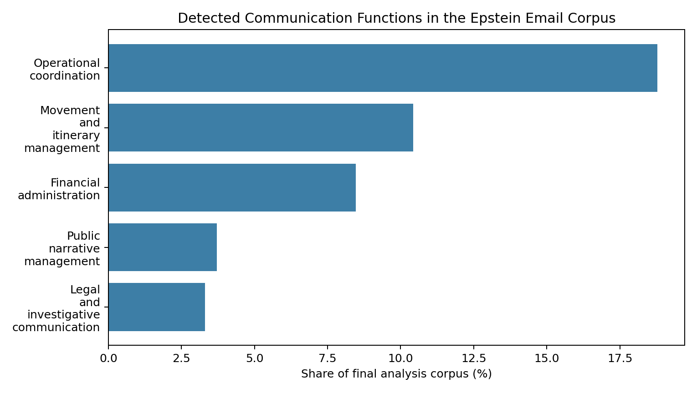
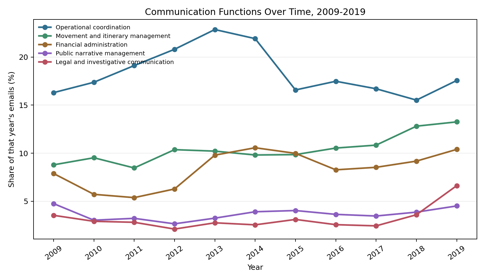
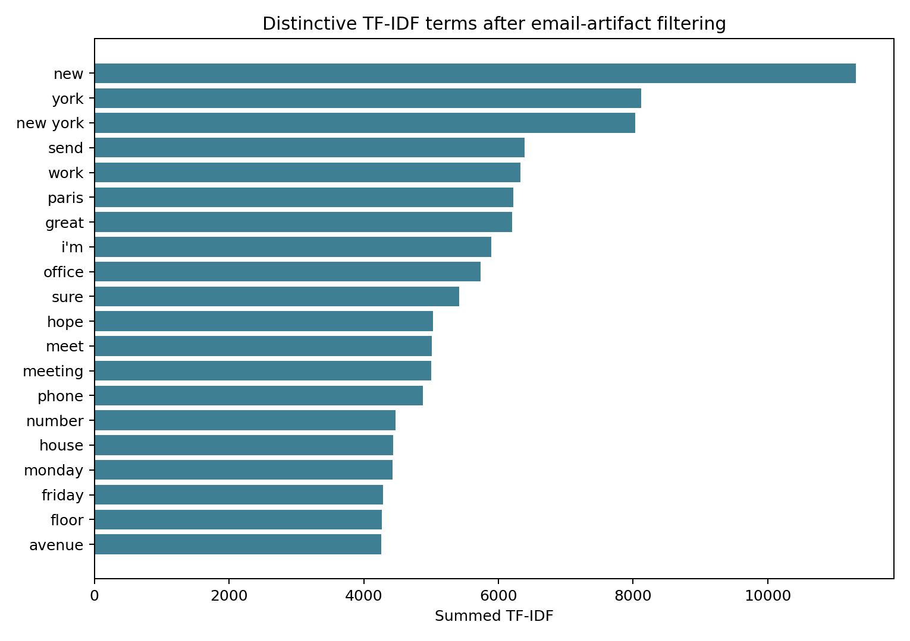

<aside class="site-rail" markdown="1">

  
MS3 Final Paper

  
Text mining meets network structure.

  

    <a href="#abstract">Abstract</a>
    <a href="#1-introduction">Introduction</a>
    <a href="#2-data-and-corpus-construction">Data and Corpus</a>
    <a href="#3-methods">Methods</a>
    <a href="#4-results">Results</a>
    <a href="#5-discussion">Discussion</a>
  

  
Artifacts

  

    <a href="./network_3d.html">Open full 3D graph</a>
    <a href="./ms3_key_corpus_statistics.html">Corpus statistics</a>
    <a href="./ms3_data_dictionary.html">Data dictionary</a>
    <a href="./ms3_network_settings.html">Network settings</a>
  

</aside>
<article class="paper" markdown="1">

# Reading an Email Archive as Text and Network

**Course:** Text Mining and Analysis  
**Group:** Gepallatok  
**Team members:** Bernath Mate, Kossuth Hugo, Medvegy Gabor, Salomon Bruno  
**Date:** May 2026  
**Project artifact:** [3D network graph](./network_3d.html) and [standalone report copy](./report.html)

## Abstract

This project analyzes the Epstein email corpus as both a textual archive and a communication network, following earlier work that treats released email collections as analyzable organizational records (Diesner et al., 2005; Klimt & Yang, 2004). The final analysis corpus contains 1,101,455 likely-English emails after filtering very short rows, visibly redacted senders, and likely non-English material. We combine interpretable text-mining methods, including term frequencies, TF-IDF, keyword-defined communication functions, and non-negative matrix factorization, with an email co-presence network built from sender, recipient, cc, and bcc metadata (Blei et al., 2003; Freeman, 1978; Lee & Seung, 1999). The main result is that the archive is dominated by operational coordination rather than a single scandal-specific vocabulary: meetings and scheduling appear in 18.78% of analyzed emails, travel and logistics in 10.43%, and finance/assets in 8.46%. The filtered co-presence network contains 1,224 nodes and 5,426 edges and is highly centralized around Jeffrey Epstein and a small set of intermediaries. These findings suggest that the released email archive is best understood as a communication infrastructure archive: it records routine coordination, and that coordination is structurally concentrated around a small number of actors.

## 1. Introduction

Email archives are often treated as administrative residue: routine messages about meetings, travel, payments, introductions, reminders, and forwarded documents. Yet precisely because email records everyday coordination, large email corpora can reveal patterns that are difficult to observe in formal reports or public narratives. The Enron corpus, for example, became important because it showed that released email collections can be studied as both text and organizational communication data (Klimt & Yang, 2004). Email archives show not only what topics recur, but also how communication is organized: who appears repeatedly, who connects otherwise separate groups, and which practical functions dominate the flow of information. This project studies the Epstein email corpus from that perspective. Rather than treating the archive as a list of names or isolated messages, we analyze it as a large textual and relational dataset whose structure can be examined through text mining and network analysis.

The broader context of the project is the public importance of the Epstein case and the continuing release, indexing, and analysis of documents connected to it. The corpus is socially sensitive: it concerns a case involving serious criminal allegations, elite networks, institutional failure, and public accountability. Prior social-network research on conspiracy and illicit coordination emphasizes that hidden or high-risk activity can depend on both strong central actors and bridging ties across otherwise separate parts of a network (Baker & Faulkner, 1993; Granovetter, 1973). For that reason, our goal is not to infer guilt, intention, or real-world relationships from email metadata alone. Instead, we ask a more limited but empirically answerable question: what communicative functions does the released email archive contain, and how are these communications structurally organized? This distinction matters because an email connection is not the same as a personal relationship, and absence from the corpus is not evidence of absence from the broader case. However, when analyzed carefully and transparently, aggregate email patterns can still provide useful evidence about coordination, centrality, brokerage, and thematic focus within the archive.

Our approach builds on two related research traditions. First, computational text analysis has long used document representations such as bag-of-words, term frequency, TF-IDF, and topic models to identify recurring themes in large corpora (Blei et al., 2003; Pedregosa et al., 2011). Methods such as non-negative matrix factorization are especially useful when interpretability matters, because they represent documents through additive topic-like components that can be inspected through their highest-weighted terms (Lee & Seung, 1999). Second, social network analysis provides tools for studying relational structure, including degree, weighted degree, betweenness centrality, communities, and shortest-path distance. Classic work on centrality emphasizes that important actors are not only those with many connections, but also those positioned between otherwise separated parts of a network (Freeman, 1978).

This project adds to the existing literature by applying a combined text-mining and network-science framework to the Epstein email corpus specifically. Previous work on email archives demonstrates that communication data can expose organizational structure, especially when message metadata is transformed into communication networks (Diesner et al., 2005). Existing Epstein-focused public resources and research provide searchable documents, named entities, investigative context, and broader facilitation-network comparisons (Pokorny, 2026). Our contribution is to connect these perspectives in a reproducible analysis pipeline. We construct a cleaned analysis corpus, remove unknown and redacted actors from the main network summaries, filter to likely English-language emails for interpretable text analysis, and produce both statistical outputs and an interactive 3D network visualization. The result is not simply a descriptive list of frequent words or central names. Instead, it is an integrated account of what the corpus is mostly about and who structures its communication patterns.

The central research question is:

<strong>How can text mining and network analysis reveal the main communicative functions of the Epstein email corpus and the key actors who structured the communication network?</strong>

The motivation for the project is both methodological and substantive. Methodologically, the corpus is a useful case for demonstrating how text mining and network science complement each other. Word-level analysis alone can show that certain themes are frequent, but it cannot show which actors connect those themes across the communication network. Network analysis alone can identify central actors, but it cannot explain what types of communication make those actors central. Combining the two approaches gives a fuller account of the archive. Substantively, the project contributes a cautious, reproducible, and interpretable analysis of a public-interest dataset where overclaiming would be especially harmful.

## 2. Data and Corpus Construction

The project uses three main analysis tables produced from the public Jmail email archive and local preprocessing outputs. Person metadata and aliases were consolidated from the Jmail people export, the Epstein Document Archive entities dataset, and the Kaggle persons-of-interest list (Epstein Document Archive, 2026; Jmail Data API, 2026; Wilomentena, 2026). The first table is `fact_emails.parquet`, with one row per email and cleaned text and metadata. The second is `bridge_email_people.parquet`, which links emails to participants. The third is `dim_people.parquet`, which stores canonical person identifiers and display names. The unit of analysis for text mining is the individual email. The unit of analysis for network analysis is the person-email participation link.

The corpus is stored across multiple linked files rather than one merged file because the project combines text mining and network analysis. Emails and people have a many-to-many relationship: one email can include several participants, and one person can appear in many emails. If all information were flattened into one file, the same email text would be duplicated once for every participant, increasing file size and making both text statistics and network construction less transparent. The normalized structure avoids this duplication: `fact_emails.parquet` preserves the email-level text, `bridge_email_people.parquet` preserves the email-person links, and `dim_people.parquet` preserves canonical person records. The filtered `ms3_clean_corpus.parquet` is then derived from these tables for the final text-mining outputs.

The raw email table contains 1,758,382 rows. The final corpus construction procedure removes rows with fewer than ten tokens, removes rows with visibly redacted senders, and applies a likely-English text filter. This produces 1,101,455 emails for the final text-mining analysis. The valid year range in this filtered corpus is 1990-2019, with a median length of 28 tokens. Unknown and redacted actors are excluded from the main network tables and graph summaries so that placeholder labels do not dominate the actor-level findings. This makes the results more interpretable, but it also means that the final network describes the visible released corpus, not the complete real-world Epstein network.

The full key corpus statistics and data dictionary are available as separate companion files created for this milestone: [key corpus statistics](./ms3_key_corpus_statistics.html) and [data dictionary](./ms3_data_dictionary.html).

The data pipeline was designed to be reproducible. Raw and intermediate data are stored separately from generated outputs, and the analysis scripts produce the cleaned corpus, summary CSVs, charts, and network files from the same local data tables. Validation checks included row-count comparisons after each filter, inspection of missing metadata, checks for implausible dates, manual review of theme examples, and robustness checks on network edge thresholds.

## 3. Methods

Before describing the models, we define the main technical terms used in the report. A *corpus* is the full collection of documents analyzed by the project; here, each document is one email. A *token* is a word-like unit after preprocessing. A *metadata field* is information attached to an email, such as sender, recipient, cc, bcc, date, or subject. A *co-presence edge* is a network connection between two actors who appear in the same email metadata. This edge does not mean that the two actors met, collaborated, or had a verified personal relationship; it only means that the released email data places them in the same communication record.

### 3.1 Text Mining

The text-mining pipeline represents each email through cleaned text after removing common email artifacts, boilerplate, attachment residue, and extremely short rows. We use four interpretable representations implemented with scikit-learn (Pedregosa et al., 2011). Term frequency identifies common corpus vocabulary after email-artifact filtering. TF-IDF identifies terms that are relatively distinctive across documents. Non-negative matrix factorization identifies broad topic-like clusters from the TF-IDF matrix (Lee & Seung, 1999). Finally, keyword-defined communication functions are used to estimate theme coverage for meetings/scheduling, travel/logistics, finance/assets, media/reputation, and legal/investigation.

Term frequency counts how often words appear in the corpus. TF-IDF, short for term frequency-inverse document frequency, gives more weight to terms that are frequent in some documents but not common everywhere, so it is useful for finding distinctive vocabulary rather than only common words. Non-negative matrix factorization is a topic-modeling method that groups words and documents into interpretable components; in this report, we use those components as topic-like summaries rather than as perfect labels. A keyword-defined communication function is a manually defined theme category, such as travel or legal communication, detected through transparent keyword lists.

These methods were chosen because the project requires interpretability. More complex models could potentially produce stronger prediction scores, but they would make it harder to explain why a theme is present and how it relates to the underlying emails. The keyword categories are therefore not treated as perfect classifiers. They are transparent indicators of broad communication functions, and their interpretation is supported by manual validation examples.

The main text model used for topic discovery is non-negative matrix factorization fitted on a TF-IDF document-term matrix. This was chosen over a more complex embedding or black-box classifier because the assignment requires interpretable results: NMF topics can be explained through their highest-weighted terms, and the output can be manually checked against representative emails. It was also more appropriate than supervised classification because the project does not have a manually labeled training set. The full vectorizer and model settings are written out separately in the [text model settings](./ms3_text_model_settings.html) companion file so the main report can stay concise.

### 3.2 Network Analysis

The network pipeline builds an undirected co-presence graph using NetworkX (Hagberg et al., 2008). Two actors are connected when they appear in the same email metadata as sender, recipient, cc, or bcc participants. Edge weights count repeated co-presence. Crowded emails with more than 25 actors are skipped to reduce the effect of bulk messages and distribution lists. The main network is filtered to remove unknown and redacted actors.

We report degree, weighted degree, and betweenness centrality. A *node* is an actor in the network, and an *edge* is a connection between two actors. Degree measures how many distinct actors a node is connected to. Weighted degree captures repeated communication co-presence by adding the strengths of a node's edges, so repeated appearances with the same actors count more than one-off appearances. Betweenness centrality measures how often a node lies on the shortest paths between other nodes; in practical terms, it identifies actors who may connect otherwise separate parts of the graph and are therefore useful for identifying brokers (Freeman, 1978). A *broker* is an actor whose position allows them to bridge different clusters or communication groups. A *connected component* is a set of nodes that can all be reached from one another through network paths. We also produce a robustness check by increasing the minimum repeated co-presence threshold from 2 to 100.

The network model is an undirected weighted co-presence graph. It was chosen because the goal is not to predict relationships, but to describe how actors are structurally connected inside the email metadata. The full network settings and justifications are written out separately in the [network settings](./ms3_network_settings.html) companion file so the main report can stay concise.

The interactive 3D visualization uses a readable subset of the filtered graph. Nodes are arranged into distance shells around Jeffrey Epstein. A one-step distance means direct co-presence with Epstein in at least one email; two steps means an actor is connected through one intermediary; and so on. This is a graph-theoretic distance, not proof of a real-world relationship.

## 4. Results

The results are organized around the research question: which communication functions dominate the corpus, and which actors structure the email network?

### 4.1 Communication Functions

The main text-mining result is that the archive is dominated by operational coordination rather than a single scandal-specific vocabulary. The largest keyword-defined communication function is meetings and scheduling, which appears in 206,843 emails, or 18.78% of the final analysis corpus. Travel and logistics appear in 114,917 emails (10.43%), finance and assets in 93,179 emails (8.46%), media and reputation in 40,916 emails (3.71%), and legal or investigative communication in 36,473 emails (3.31%).

| Communication function | Emails | Share | Interpretation |
|---|---:|---:|---|
| Operational coordination | 206,843 | 18.78% | Calls, meetings, appointments, reservations, and availability dominate the corpus. |
| Movement and itinerary management | 114,917 | 10.43% | Flights, hotels, cars, airports, itineraries, and arrivals/departures form a major practical layer. |
| Financial administration | 93,179 | 8.46% | Payments, banks, invoices, accounts, tax, investments, and property appear frequently. |
| Public narrative management | 40,916 | 3.71% | Press, reporters, articles, statements, interviews, and reputation-related terms form a smaller distinct theme. |
| Legal and investigative communication | 36,473 | 3.31% | Court, lawyer, filing, investigation, witness, deposition, and settlement vocabulary marks the legal layer. |

This means the archive should be read primarily as a record of routine coordination, not as a corpus dominated by explicit legal or scandal-specific language. The most frequent functions are ordinary but important: arranging time, movement, money, and communication. In practical terms, the text-mining result shows the everyday administrative layer through which the network operated in the released emails. Legal and media material are present, but they are not the dominant communication functions by volume. Theme shares are not mutually exclusive: one email can match more than one communication function.

The keyword themes are deliberately simple. This makes them transparent and reproducible, but they should not be interpreted as a fully validated supervised classifier. Manual validation examples generally supported the broad keyword categories, but also showed that some matches capture quoted text, boilerplate, or administrative context rather than the immediate intent of the email. For this reason, theme counts are interpreted as corpus-level indicators, not document-level labels.

The same communication functions can also be examined over time. Figure 2 reports each theme as a share of that year's emails, rather than as raw counts, so years with more documents do not automatically dominate the comparison. Operational coordination remains the largest theme in every year from 2009 to 2019. This means the coordination finding is not driven by one unusually large year; it is a stable pattern across the main research period. Travel/logistics and finance/assets remain consistently visible secondary functions, which means the archive repeatedly records practical movement and resource administration alongside scheduling. Legal/investigative communication is smaller for most years but rises in 2019, while media/reputation remains a distinct but lower-volume layer. This chart does not prove that specific external events caused yearly changes; instead, it shows that the archive's communication functions are mostly stable, with a visible legal/investigative increase in the final year of the corpus. This visualization stays directly tied to the research question because it shows not only what communicative functions appear in the corpus, but also whether those functions are stable or changing across the main research period.

### 4.2 Topic Model Interpretation

The NMF outputs point in the same direction. Several topics capture everyday interpersonal coordination, travel-service administration, itinerary timing, banking and wealth-management correspondence, calendar notifications, and legal confidentiality material. Some topics are partly contaminated by address and notification artifacts, which is itself an important validation result: the corpus remains noisy even after cleaning, so topic outputs should be interpreted as evidence of broad communication functions rather than precise semantic categories.

The broad third topic is the clearest limitation of the topic model. It covers 77.00% of documents, which means NMF did not separate most short coordination emails into many fine-grained semantic groups. Substantively, this still tells us something important: a large part of the archive consists of generic, everyday coordination language rather than sharply separated topical documents. We therefore treat NMF as a supporting interpretive check rather than the main evidence. The main claim does not rely on NMF alone: it is supported independently by keyword theme coverage, TF-IDF terms, the theme-over-time chart, and the network results. The full topic table is available separately in the [NMF topic table](./ms3_nmf_topic_table.html) companion file.

### 4.3 Network Centralization

The filtered co-presence network contains 1,224 nodes and 5,426 edges after excluding unknown and redacted actors from the main reported graph. Jeffrey Epstein is the dominant actor by degree, weighted degree, and betweenness centrality. This means he is not only connected to many actors, but also repeatedly appears in shared communication records and sits on many shortest paths through the network. Lesley Groff and Richard Kahn are the next strongest brokers, followed by actors such as Stewart Oldfield, Brad Edwards, Karyna Shuliak, Ghislaine Maxwell, Paul Morris, and Daphne Wallace. This means the archive is not diffuse: communication is highly centralized around Epstein and a small set of intermediaries who connect operational, financial, legal, and social parts of the corpus.

| Actor | Degree | Weighted degree | Betweenness | Interpretation |
|---|---:|---:|---:|---|
| Jeffrey Epstein | 730 | 343,926 | 0.904 | Dominant central ego and broker; communication is structurally centered on him. |
| Lesley Groff | 390 | 110,003 | 0.246 | Administrative intermediary with repeated co-presence and high brokerage. |
| Richard Kahn | 242 | 74,112 | 0.154 | Financial/administrative intermediary near the center of repeated exchanges. |
| Stewart Oldfield | 96 | 32,757 | 0.091 | Operational intermediary connecting parts of the co-presence graph. |
| Brad Edwards | 24 | 903 | 0.038 | Legal cluster connector with relatively high betweenness despite lower degree. |
| Karyna Shuliak | 153 | 25,042 | 0.035 | Frequent direct-contact actor with repeated participation in central communication. |
| Ghislaine Maxwell | 56 | 3,753 | 0.030 | Social/legal cluster connector with a bridge-like network position. |
| Paul Morris | 84 | 28,679 | 0.029 | Operational/administrative connector across central exchanges. |

### 4.4 Interactive 3D Network

The interactive graph is a companion artifact to the report. It is designed for exploration while reading, not as standalone evidence. The analytical claims rely on the centrality table, broker chart, and robustness checks. Epstein is the gold center node. Green nodes are one network step away, blue nodes are two steps away, purple nodes are three steps away, and pink nodes are four or more steps away. Node size decreases with distance from Epstein.

<iframe src="./network_3d.html" title="Interactive 3D Epstein email network" style="width:100%; height:620px; border:1px solid #d9d5cd;"></iframe>

### 4.5 Robustness Check

The edge-threshold robustness check strengthens the centralization interpretation. When the minimum repeated co-presence threshold is increased from 2 to 100, the network becomes smaller, but Epstein remains the top weighted-degree actor at every threshold. The largest connected component also remains very large, ranging from 95.75% of nodes at threshold 2 to 98.30% at threshold 100. This means the main network finding is not just an artifact of occasional one-off co-presences; the central structure remains visible even when only repeated ties are retained.

| Minimum edge weight | Nodes | Edges | Largest component | Top weighted-degree actor |
|---:|---:|---:|---:|---|
| 2 | 1,224 | 5,426 | 95.75% | Jeffrey Epstein |
| 5 | 610 | 3,005 | 97.21% | Jeffrey Epstein |
| 10 | 434 | 2,116 | 97.24% | Jeffrey Epstein |
| 25 | 326 | 1,352 | 97.24% | Jeffrey Epstein |
| 50 | 271 | 969 | 98.15% | Jeffrey Epstein |
| 100 | 235 | 710 | 98.30% | Jeffrey Epstein |

As an additional robustness check, we also tested a directed sender-recipient graph using the same final corpus and the same unknown/redacted actor filtering. This alternative graph contains 1,028 nodes and 4,815 repeated directed ties at the same minimum edge weight of 2. Its largest weak component contains 96.50% of nodes, and Epstein is both the top weighted sender and the top weighted recipient. This means the centralization result is not only an artifact of treating all email participants as undirected co-presences; it also appears when communication direction is preserved.

## 5. Discussion

The results answer the research question in two connected ways. Text mining reveals that the corpus is mostly about practical coordination: scheduling, travel, finance, media/reputation, and legal communication. Network analysis reveals that this coordination is structurally concentrated around Epstein and a small set of intermediaries. Together, this means the archive is best interpreted as a centralized coordination system: the text shows what work the communication performs, and the network shows who sits at the center of that work.

The findings also clarify what kind of archive this is. It is not best understood as only a collection of scandal keywords or legal documents. Instead, it is a communication infrastructure archive. Its most visible patterns are routine and administrative, but those routines are precisely what make the structure observable. This interpretation is consistent with network research showing that organizational and illicit structures can be visible through repeated coordination patterns and broker positions, even when the underlying relationships are not directly observed (Baker & Faulkner, 1993; Freeman, 1978; Granovetter, 1973). Travel arrangements, meetings, financial administration, and legal/media communication are not separate from the network; they are the communicative practices through which the network appears in the data.

There are business and societal implications. From an organizational-risk perspective, the project shows how routine communication metadata can reveal centralization, dependency on intermediaries, and operational patterns, similar to earlier findings from email-network research on organizational communication (Diesner et al., 2005). From a public-interest perspective, it shows why transparent, reproducible analysis matters for sensitive document archives. The project avoids turning computational patterns into accusations, but it still provides a structured way to understand the released corpus and to compare it cautiously with broader Epstein facilitation-network research (Pokorny, 2026).

## 6. Error Analysis and Threats to Validity

The main threats to validity are metadata incompleteness, redaction, short-message noise, remaining OCR/cleaning artifacts, and the interpretation of email co-presence. The 10-token filter removes 560,622 very short rows; this improves text mining, but it may exclude short operational replies. Redacted sender metadata removes another 94,280 rows after the length filter, and 179,993 person-email links contain unknown or redacted labels. These records could change actor-level conclusions if identities were known.

| Issue | Evidence | Risk | Mitigation |
|---|---|---|---|
| Very short or empty emails | 560,622 rows removed by the 10-token filter. | Short replies are weak text-mining units and can distort topic modeling. | Exclude from final text-model outputs; keep in corpus context. |
| Redacted sender metadata | 94,280 rows removed after the redacted-sender filter. | Sender-level and network findings are incomplete when identities are hidden. | Remove unknown/redacted actors from main centrality tables and report as limitation. |
| Language uncertainty | 2,025 rows removed by likely-English filtering after sender filtering. | Some short English-like messages may be excluded; some OCR-heavy English may remain noisy. | Frame final text results as English-focused. |
| Unknown/redacted actor links | 179,993 person-email links contain unknown/redacted labels. | Placeholder actors can dominate network statistics. | Filter from main network and mention metadata bias. |
| Email co-presence interpretation | Edges mean actors appeared in the same email metadata. | Network visuals can be overread as evidence of social proximity or wrongdoing. | Define edge semantics clearly in Methods and Discussion. |

The mitigation strategies reduce the most obvious sources of distortion, but they do not remove all uncertainty. Filtering redacted actors improves interpretability while also excluding potentially meaningful hidden structure, and keyword themes provide transparent corpus-level indicators rather than validated document-level labels. The language filter removes 2,025 rows after sender filtering, but language detection remains uncertain for short or OCR-heavy messages. Therefore, the final text-mining results should be described as English-focused rather than multilingual. Finally, a co-presence edge means that two actors appeared in the same email metadata field, not that they had a verified real-world relationship. The network results should therefore be interpreted as reproducible evidence about the released email archive, not as a complete reconstruction of the broader real-world network or as proof of social closeness, intent, or wrongdoing.

## 7. Responsible AI and LLM Use

LLMs were used to support coding, report planning, wording, and interpretation drafting. All numerical claims, tables, and figures were generated from local scripts and checked against CSV/image outputs; LLM-generated prose was manually edited and verified against those outputs. LLMs were not used to invent facts, assign guilt, infer private intent, or identify hidden relationships. Sensitive claims are limited to aggregate corpus and network patterns. The workflow used manual verification of the generated outputs, explicit caveats around co-presence edges, and conservative language for actor interpretation.

## 8. Conclusion and Next Steps

The research question can be answered directly: the corpus is dominated by operational coordination, and that coordination is structurally centralized around Epstein and a small group of intermediaries. The strongest result is not a single keyword, topic, or name. It is the alignment between textual function and network structure.

Future work should improve the pipeline in five ways. First, language detection should be strengthened for short and OCR-heavy messages. Second, entity resolution should be manually validated for high-centrality actors. Third, temporal network analysis should test whether centrality and theme composition shift around legally significant events. Fourth, supervised theme classification could replace transparent keyword groups after enough manually labeled examples are created. Fifth, the email co-presence network should be compared with external evidence such as court documents, flight logs, and investigative records to separate corpus-specific communication structure from broader real-world relationships.

## Appendix: Key Parameters and Outputs

| Parameter / output | Value |
|---|---|
| Minimum text length for final text analysis | 10 tokens |
| Language scope | Likely English |
| Sender-redacted rows | Excluded from final analysis corpus |
| Unknown/redacted actors | Excluded from main network tables |
| Co-presence edge rule | Two actors appear in the same email metadata |
| Crowded-email cutoff | Emails with more than 25 actors skipped for co-presence edges |
| Main network edge threshold | At least 2 repeated co-presences |
| NMF topics | 8 |
| Data dictionary companion file | `docs/ms3_data_dictionary.md`; reproducible package copy: `outputs/ms3/data_dictionary.csv` |
| Key corpus statistics companion file | `docs/ms3_key_corpus_statistics.md`; reproducible package copy: `outputs/ms3/key_corpus_statistics.csv` |
| Text model settings companion file | `docs/ms3_text_model_settings.md` |
| NMF topic table companion file | `docs/ms3_nmf_topic_table.md`; reproducible package copy: `outputs/ms3/report_assets/report_nmf_topic_labels.csv` |
| Network settings companion file | `docs/ms3_network_settings.md` |
| Interactive graph | `docs/network_3d.html` |
| Theme-over-time chart data | `outputs/ms3/report_assets/theme_over_time.csv` |
| Directed network robustness check | `outputs/ms3/report_assets/directed_network_check.csv` |
| Main MS3 analysis script | `scripts/ms3_analysis.py` |
| Report asset generation script | `scripts/ms3_report_assets.py` |
| Theme-over-time script | `scripts/ms3_theme_over_time.py` |
| Directed network check script | `scripts/ms3_directed_network_check.py` |
| Interactive 3D graph script | `scripts/build_3d_network.py` |

## Tasks and Responsibilities

| Team member | Responsibility |
|---|---|
| Bernath Mate | Report drafting, research-question narrowing, interpretation of exploratory findings. |
| Kossuth Hugo | Corpus statistics, metadata missingness, date coverage, and data dictionary documentation. |
| Medvegy Gabor | TF-IDF, n-grams, KWIC outputs, network baseline outputs, report asset generation, and chart integration. |
| Salomon Bruno | Preprocessing review, cleaned corpus preparation, readability and lexical diversity diagnostics. |

## References

Baker, W. E., & Faulkner, R. R. (1993). The social organization of conspiracy: Illegal networks in the heavy electrical equipment industry. *American Sociological Review, 58*(6), 837-860. https://doi.org/10.2307/2095954

Blei, D. M., Ng, A. Y., & Jordan, M. I. (2003). Latent Dirichlet allocation. *Journal of Machine Learning Research, 3*, 993-1022. https://jmlr.org/papers/v3/blei03a.html

Diesner, J., Frantz, T. L., & Carley, K. M. (2005). Communication networks from the Enron email corpus: "It's always about the people. Enron is no different." *Computational and Mathematical Organization Theory, 11*(3), 201-228. https://doi.org/10.1007/s10588-005-5377-0

Epstein Document Archive. (2026). *Download datasets: Entities and people* [Data set]. https://www.epsteininvestigation.org/download

Freeman, L. C. (1978). Centrality in social networks: Conceptual clarification. *Social Networks, 1*(3), 215-239. https://doi.org/10.1016/0378-8733(78)90021-7

Granovetter, M. S. (1973). The strength of weak ties. *American Journal of Sociology, 78*(6), 1360-1380. https://doi.org/10.1086/225469

Hagberg, A. A., Schult, D. A., & Swart, P. J. (2008). Exploring network structure, dynamics, and function using NetworkX. In G. Varoquaux, T. Vaught, & J. Millman (Eds.), *Proceedings of the 7th Python in Science Conference* (pp. 11-15). https://doi.org/10.25080/TCWV9851

Jmail Data API. (2026). *Public data API for the Jmail email archive* [Data set]. https://jmail.world/docs/introduction

Klimt, B., & Yang, Y. (2004). Introducing the Enron Corpus. In *Proceedings of the First Conference on Email and Anti-Spam*. https://www.ceas.cc/papers-2004/168.pdf

Lee, D. D., & Seung, H. S. (1999). Learning the parts of objects by non-negative matrix factorization. *Nature, 401*, 788-791. https://doi.org/10.1038/44565

Pedregosa, F., Varoquaux, G., Gramfort, A., Michel, V., Thirion, B., Grisel, O., Blondel, M., Prettenhofer, P., Weiss, R., Dubourg, V., Vanderplas, J., Passos, A., Cournapeau, D., Brucher, M., Perrot, M., & Duchesnay, E. (2011). Scikit-learn: Machine learning in Python. *Journal of Machine Learning Research, 12*(85), 2825-2830. https://jmlr.org/papers/v12/pedregosa11a.html

Pokorny, L. (2026). *Social network analysis of Jeffrey Epstein and other elite offenders' facilitation networks through a psychopossession lens*. Zenodo. https://doi.org/10.5281/zenodo.18795644

Wilomentena. (2026). *Epstein files - Persons of interest list* [Data set]. Kaggle. https://www.kaggle.com/datasets/wilomentena/epstein-list-persons-of-interest
</article>

<aside class="insight-rail" markdown="1">

  
Core Result

  

    <strong>1,101,455</strong>
    likely-English emails in the final text-mining corpus
  

  

    <strong>1,224</strong>
    actors in the filtered co-presence network
  

  

    <strong>5,426</strong>
    repeated co-presence edges after filtering
  

  
Reading Guide

  
Use the report text for the argument, the embedded graph for exploration, and the companion files for reproducibility details that would be too long for the final paper.

  
Companion Files

  

    <a href="./ms3_text_model_settings.html">Text model settings</a>
    <a href="./ms3_nmf_topic_table.html">NMF topic table</a>
    <a href="./report.html">Standalone report</a>
  

</aside>

